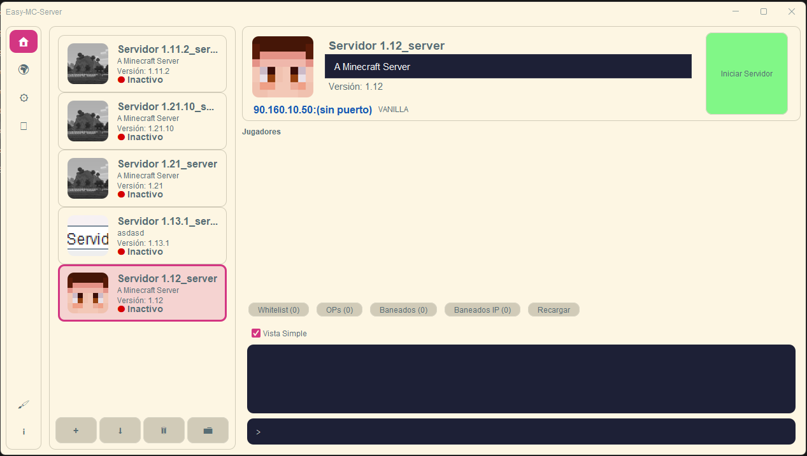

# Easy MC Server

Easy MC Server is a Java desktop application for managing Minecraft servers from a single graphical interface. It focuses on everyday administration tasks such as creating or importing servers, starting and stopping them, reading live console output, editing server settings, and managing connected players.



## Features

- Create new Minecraft server instances from Mojang server jars
- Import existing server folders
- Manage multiple servers from one window
- Start, stop, and monitor servers in real time
- View live console output and send commands
- Edit key server settings from the UI
- Preview server information such as icon, MOTD, version, and address
- Manage player-related lists and actions from the interface

## Requirements

- Java 17
- Maven

## Build

```bash
mvn clean package
```

The project uses the Maven Shade Plugin to generate an executable jar with its dependencies.

## Run

```bash
java -jar target/easy_mc_server_0.2-1.0-SNAPSHOT.jar
```

You can also run the application directly from your IDE using the main class:

`controlador.Main`

## Basic usage

1. Launch the application.
2. Create a new server or import an existing one.
3. Select a server from the list.
4. Use the control panel to start or stop it.
5. Use the console view to monitor logs and send commands.
6. Adjust server settings and player-related options from the side panels.

## Notes

This project is built with Swing and uses FlatLaf for the UI, Jackson for JSON handling, Gson for selected data processing, and Lombok to reduce boilerplate.