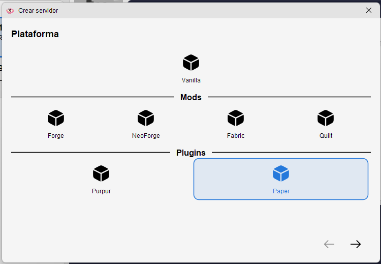
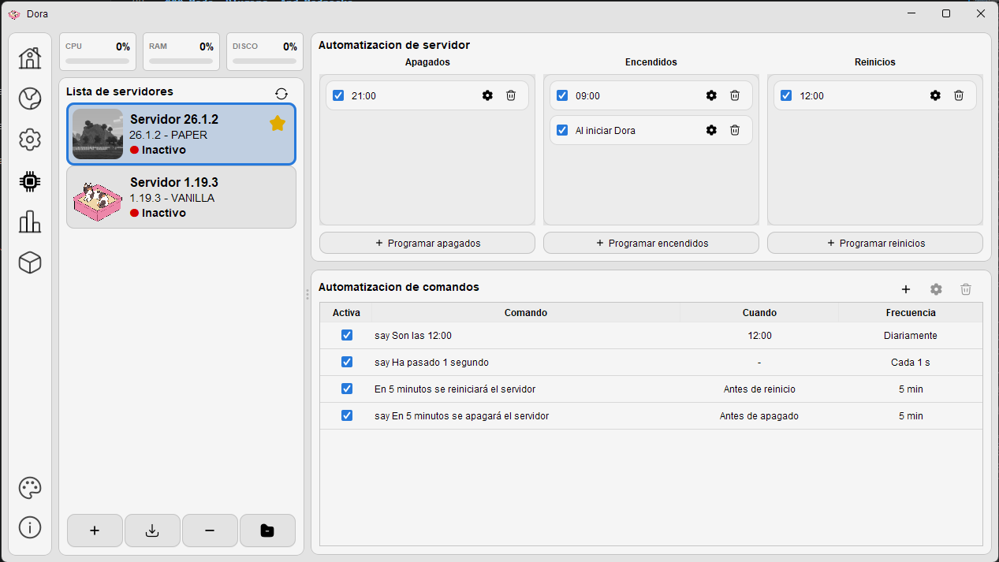
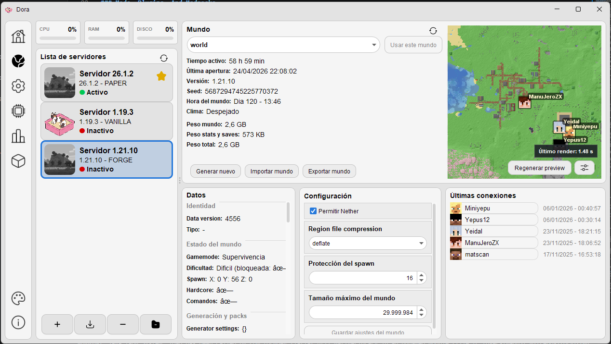
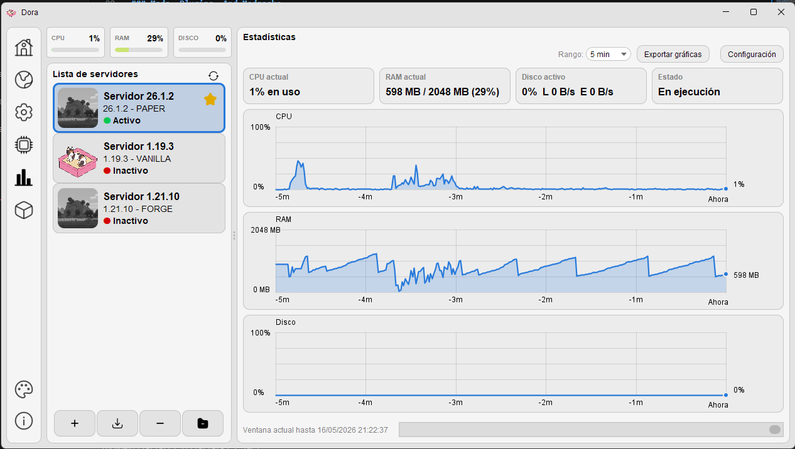
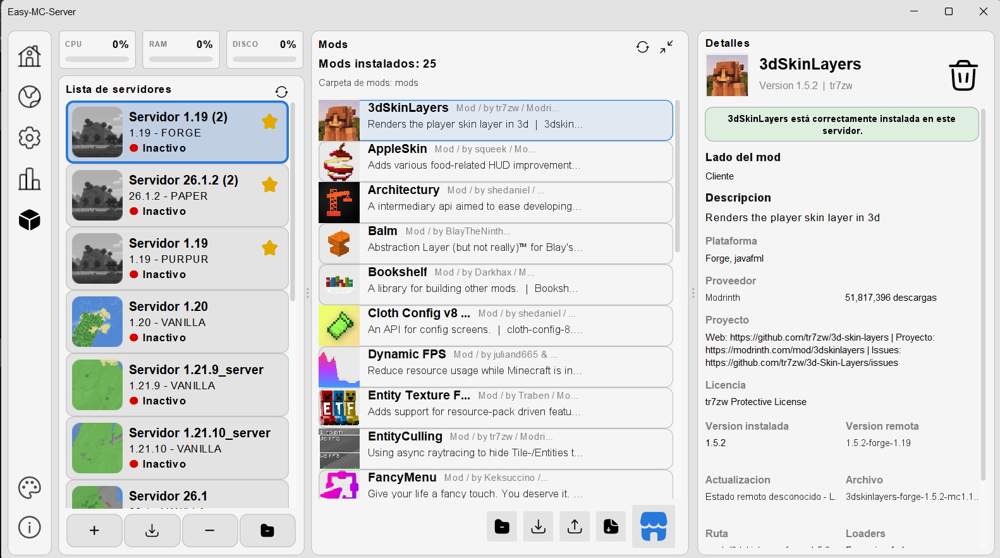
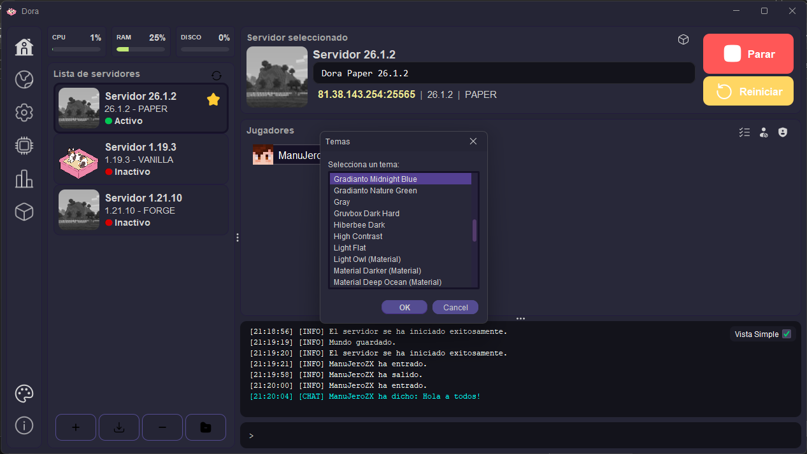

<div align="center">

# Dora

**A graphical Minecraft server manager for creating, importing, running, and organizing local servers.**


Dora helps you manage Minecraft servers from one friendly desktop app: create or import servers, start and stop them, automate routine actions, read the live console, edit settings, manage worlds and players, and work with mods, plugins, and modpacks without living in terminal windows.


[Features](#features) • [Screenshots](#screenshots) • [Installation](#installation) • [Quick Start](#quick-start) • [For Developers](#for-developers)

</div>

<a id="why-dora"></a>

## 🐈 Why Dora

Running a Minecraft server usually means juggling startup commands, `server.properties`, logs, world folders, player lists, icons, platform downloads, mods, and plugins. Dora brings those everyday tasks into one visual workspace so you can focus on the server instead of the plumbing.

| Dora is useful when you want to... | How it helps |
| --- | --- |
| Host a server for friends | Create, start, stop, and monitor servers from one app. |
| Keep multiple servers organized | Import existing folders and switch between servers quickly. |
| Test platforms and Minecraft versions | Work with Vanilla, Forge, NeoForge, Fabric, Quilt, Paper, and Purpur flows. |
| Avoid repetitive admin work | Schedule starts, stops, restarts, and console commands. |
| Manage long-running servers | Keep Dora available from the system tray while servers continue running. |
| Spend less time editing files by hand | Use panels for settings, worlds, players, extensions, and server metadata. |

<a id="features"></a>

## ✨ Features

| Area | What Dora Provides |
| --- | --- |
| **Server management** | Create servers with a guided wizard, import existing folders, organize multiple servers, start, stop, restart, and monitor server state. |
| **Platform workflows** | Automated creation for Vanilla, Forge, NeoForge, Fabric, Quilt, Paper, and Purpur, plus import and detection support for additional plugin server folders where metadata is available. |
| **Conversion** | Convert compatible servers to another supported platform with a visual platform selector and optional full backup. |
| **Console** | Read styled live output and send commands directly from the app. |
| **Automation** | Schedule server starts, stops, restarts, and commands on app start, daily times, intervals, or around lifecycle events. |
| **Configuration** | Edit runtime and server presentation details such as memory, port, version, MOTD, icon, and address preview. |
| **Worlds** | Manage active worlds, import and export worlds, inspect metadata, and generate previews from MCA region files. |
| **Players** | Manage known and connected players, whitelist entries, bans, banned IPs, and operators. |
| **Extensions** | Install local `.jar` mods and plugins, browse compatible catalog providers, track metadata, and import or export supported CurseForge-style server modpack data. |
| **Appearance** | Choose from many FlatLaf themes to match your desktop style. |

<a id="screenshots"></a>

## 🖼️ Screenshots

| Home And Server Overview | Server Creation Wizard |
| --- | --- |
| See your servers at a glance, check their current state, and jump into the main management areas from one central screen. | Create a server step by step with platform selection, version choices, and a guided folder setup flow. |
|  |  |

| Automation | Worlds |
| --- | --- |
| Schedule starts, stops, restarts, and console commands so routine server tasks can run without manual intervention. | Inspect world metadata, manage active worlds, and review world-related tools from the server world panel. |
|  |  |

| Statistics | Extension Catalog |
| --- | --- |
| Monitor server resource usage and runtime information in a compact panel built for quick checks. | Browse compatible mods and plugins, review extension metadata, and prepare installs from supported catalog providers. |
|  |  |

| Themes |
| --- |
| Select from many FlatLaf themes to make Dora match your preferred desktop style. |
|  |

<a id="installation"></a>

## 🚀 Installation

### Requirements

- Java 25 or newer.
- A desktop environment capable of running Java Swing applications.

### Install A Release Build

If a prebuilt Dora `.jar` is available:

1. Download the latest Dora release artifact.
2. Make sure Java 25 is installed and available from your terminal.
3. Run the downloaded file:

```bash
java -jar dora_0.7.1-beta.jar
```

> [!NOTE]
> If no release artifact is available yet, source builds are documented in [For Developers](#for-developers).

<a id="quick-start"></a>

## ⚡ Quick Start

1. Launch Dora.
2. Create a new server or import an existing Minecraft server folder.
3. Choose the server platform, such as Vanilla, Forge, NeoForge, Fabric, Quilt, Paper, or Purpur.
4. Select the server from the side list.
5. Start the server from the main controls.
6. Open the console to watch logs and send commands like `say`, `op`, `whitelist`, or `save-all`.
7. Use the settings, worlds, players, automation, and extensions sections to manage the server.

<a id="common-workflows"></a>

## 🧭 Common Workflows

<details>
<summary><strong>Create a new server</strong></summary>

1. Choose the create-server action in Dora.
2. Pick the platform from the icon selector.
3. Choose the Minecraft version, including snapshots where the platform supports them.
4. Select the destination folder.
5. Let Dora prepare the server files.
6. Open the new server from the server list and start it.

</details>

<details>
<summary><strong>Import an existing server</strong></summary>

1. Choose the import action.
2. Select the existing server folder.
3. Let Dora detect available metadata.
4. Review the imported server in the side list.

</details>

<details>
<summary><strong>Convert a server platform</strong></summary>

1. Select an imported or managed server.
2. Choose the conversion action.
3. Pick a compatible target platform.
4. Choose whether Dora should create a full backup first.
5. Let Dora prepare the server files.
6. Review the converted server before starting it.

</details>

<details>
<summary><strong>Manage worlds</strong></summary>

1. Open a server.
2. Go to the world management section.
3. Review the active world, metadata, storage, and preview information.
4. Import, export, or switch worlds as needed.

</details>

<details>
<summary><strong>Install mods or plugins</strong></summary>

1. Open a server that supports extensions.
2. Go to the extensions section.
3. Install a local `.jar` file or browse a compatible catalog provider.
4. Review compatibility and metadata before installing.
5. Restart the server when the extension requires it.

</details>

<details>
<summary><strong>Automate routine tasks</strong></summary>

1. Open a server.
2. Go to the automation section.
3. Add a lifecycle rule for starts, stops, or restarts.
4. Add command rules for routine console commands.
5. Enable the rules you want Dora to run automatically.

</details>

<a id="for-developers"></a>

## 🛠️ For Developers

### Developer Requirements

- Java 25
- Maven 3.9 or newer

### Tech Stack

| Layer | Tools |
| --- | --- |
| Desktop UI | Java Swing, FlatLaf, FlatLaf Extras |
| Build | Maven, Maven Shade Plugin |
| Data | Jackson, Gson, Querz NBT tooling |
| Icons and rendering | JSVG, SVG resources in `src/main/resources/doraicons` |
| Tests | JUnit 5, AssertJ |
| Boilerplate | Lombok |

### Build From Source

```bash
git clone <repository-url>
cd Dora
mvn clean package
```

The executable jar is generated in `target/`:

```bash
java -jar target/dora_0.7.1-beta.jar
```

### Run From Source

```bash
java -jar target/dora_0.7.1-beta.jar
```

You can also run the app from your IDE using:

```text
controlador.Main
```

### Test

```bash
mvn test
```

For narrow UI or documentation-adjacent changes, a compile check is often enough:

```bash
mvn -q -DskipTests compile
```

### Repository Layout

```text
src/main/java/controlador   Application logic, services, installers, server lifecycle
src/main/java/vista         Swing views, panels, custom components, theme helpers
src/main/java/modelo        Domain models and configuration objects
src/main/resources          UI resources, including SVG icons
src/test/java               Unit and integration-style tests
docs                        Pipeline guides, feature notes, fix notes, and work notebooks
```

<a id="project-documentation"></a>

## 📚 Project Documentation

| Path | Purpose |
| --- | --- |
| [`docs/README.md`](docs/README.md) | Routes work by subsystem. |
| [`docs/pipelines/`](docs/pipelines/) | Documents important implementation pipelines. |
| [`docs/pending-fixes/`](docs/pending-fixes/) | Tracks known issues and cleanup candidates. |
| [`docs/fixes/`](docs/fixes/) | Records solved issues and regression tips. |
| [`docs/pending-features/`](docs/pending-features/) | Tracks requested features that are not implemented yet. |
| [`docs/features/`](docs/features/) | Documents completed features. |

<a id="troubleshooting"></a>

## 🧯 Troubleshooting

### Java Version

Dora targets Java 25. If the app does not start, check your installed Java version:

```bash
java --version
```

### Missing Server Files

When importing a server, choose the server folder itself, not only the world folder. A typical server folder contains files such as `server.properties`, server jars, logs, or world folders.

<a id="contributing"></a>

## 🤝 Contributing

There is no standalone `CONTRIBUTING.md` yet. For now:

1. Read [`docs/README.md`](docs/README.md) before changing an established area.
2. Follow the matching guide in [`docs/pipelines/`](docs/pipelines/).
3. Keep user-facing Spanish copy consistent with the existing app terminology.
4. Run the relevant checks from [For Developers](#for-developers) before submitting changes.

Bug fixes and feature work should also update the appropriate notes in `docs/fixes/`, `docs/pending-fixes/`, `docs/features/`, or `docs/pending-features/`.

<a id="status-and-roadmap"></a>

## 🗺️ Status And Roadmap

Dora is currently a beta desktop application. The app is actively evolving around server creation, platform installation, world management, extension handling, UI responsiveness, and developer documentation.

Planned or unfinished work is tracked in:

- [`docs/pending-features/`](docs/pending-features/)
- [`docs/pending-fixes/`](docs/pending-fixes/)

<a id="license"></a>

## 📄 License

Dora is licensed under the [GNU General Public License v3.0](LICENSE).
