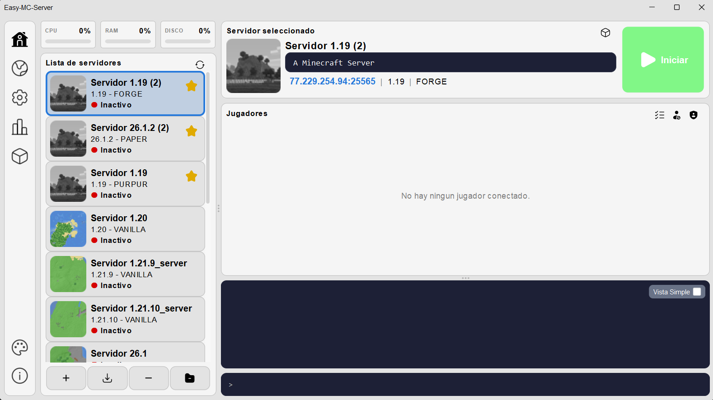

# Easy MC Server

Easy MC Server is a Java desktop application for managing Minecraft servers from a single graphical interface. It focuses on everyday administration tasks such as creating or importing servers, starting and stopping them, reading live console output, editing server settings, managing worlds, and installing extensions.



## Features

- Create new Minecraft server instances through a guided wizard.
- Import existing server folders and keep multiple servers organized in one window.
- Create servers for supported automated platforms, including Vanilla, Forge, NeoForge, Fabric, Quilt, Paper, and Purpur.
- Import and detect additional existing server folders where platform metadata is available.
- Start, stop, restart, and monitor servers in real time.
- View styled live console output and send commands from the UI.
- Edit server settings and runtime options from organized configuration panels.
- Manage server presentation data such as icon, MOTD, version, port, and address preview.
- Manage connected players plus whitelist, bans, banned IPs, and OP lists.
- Manage worlds, switch active worlds, import/export worlds, edit world options, and inspect world metadata.
- Generate and view Minecraft world previews from MCA region files with configurable render presets and overlays.
- Manage mods/plugins, install local jars, browse catalog providers, resolve compatibility, and track extension metadata.
- Export and import supported CurseForge-style server modpack data.
- Use Debug mode to exercise selected UI states with in-memory fake data.

## Requirements

- Java 25
- Maven

## Build

```bash
mvn clean package
```

The project uses the Maven Shade Plugin to generate an executable jar with its dependencies.

For a faster compile-only check:

```bash
mvn -q -DskipTests compile
```

## Run

```bash
java -jar target/easy_mc_server_0.6-beta.jar
```

You can also run the application directly from your IDE using the main class:

`controlador.Main`

## Basic usage

1. Launch the application.
2. Create a new server or import an existing one.
3. Select a server from the list.
4. Use the control panel to start or stop it.
5. Use the console view to monitor logs and send commands.
6. Adjust server settings, worlds, extensions, preview data, and player-related options from the side panels.

## Project documentation

Developer-oriented notes live in `docs/`:

- `docs/README.md` routes work by subsystem.
- `docs/pipelines/` documents program pipelines and important implementation boundaries.
- `docs/pending-fixes/` tracks known issues and cleanup candidates.
- `docs/fixes/` records solved issues and regression tips.

## Notes

This project is built with Swing and FlatLaf. It uses Jackson and Gson for data handling, Lombok to reduce boilerplate, JUnit 5 and AssertJ for tests, JSVG for SVG rendering, and Querz NBT tooling for Minecraft world data.
